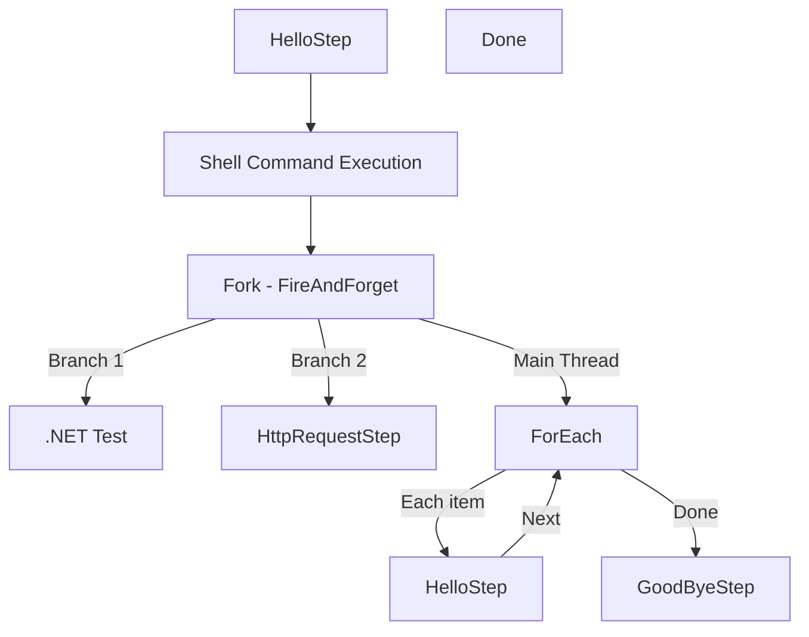

# Visualizing workflows as graphs
FFlow has built in support for converting workflows into graphs. With them, you can serialize them into custom formats like Mermaid Diagrams. By default, nodes will use `StepNameAttribute` to name their nodes, otherwise their type name is used. You can also define custom graph structures for individual steps, as some built in nodes (`If`, `Fork`, `Switch`, etc) already do that.

## Converting workflows to graphs
To convert the current setup of a builder into a graph, simply call the `IWorkflowBuilder.Describe()` extension method. It will generate an instance of `WorkflowGraph` that contains all the nodes and edges of the workflow.

## Defining custom graphs for steps
To define custom graphs for your step, you **need** to inherit from `IDescribableStep` and implement the `Describe` method.

You can set which node will be used as an output by setting `ContinueFrom` or `ContinueFromId`, and adding a custom label to it by setting `ExitEdgeLabel`, below is an example.

```csharp
public WorkflowGraph Describe(string? rootId = null)
{
    var graph = new WorkflowGraph();
    var metadata = StepMetadataRegistry.Instance.Value.GetMetadata(this.GetType());

    rootId ??= metadata.Id;
    var rootNode = new WorkflowNode(rootId, $"My Step Root Name");
    graph.Nodes.Add(rootNode);

    var someNode = new WorkflowNode($"{rootId}_someNode", "Some node");
    graph.Nodes.Add(someNode);
    graph.Edges.Add(new WorkflowEdge(rootNode.Id, someNode.Id, "Some Label"));

    var someOtherNode = new WorkflowNode($"{rootId}_someOtherNode", "Some other node");
    graph.Nodes.Add(someOtherNode);
    graph.Edges.Add(new WorkflowEdge(rootNode.Id, someOtherNode.Id, "Some other label"));

    graph.ContinueFromId = rootId;
    graph.ExitEdgeLabel = "Continue from here!";
    return graph;
}
```

Which results in the following mermaid graph. 



> [!NOTE]
> This graph has been changed into a Left-Right graph for convenience, by default it is a Top-Down graph.

### Using subgraphs inside custom graphs
When your custom step uses an `IWorkflowBuilder` internally (like `Fork`, for example), you need to manually merge the builder's graph into your custom graph. You can do this by calling `Merge` on the `WorkflowGraph` instance.

> [!IMPORTANT]
> This does not mean the graph will be automatically connected. You need to manually add edges to connect the nodes in your custom graph to the nodes in the subgraph.